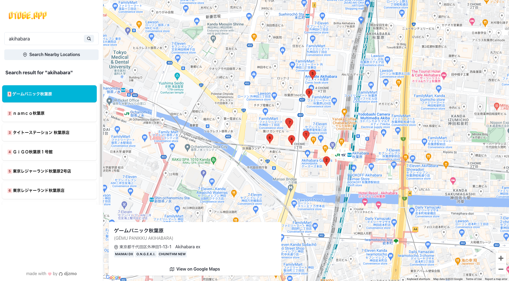

<a href="https://otoge.app" target="_blank"></a>

# otoge.app - Music Games Locator

> Web application to locate arcade music video games near you.

[Getting Started](#getting-started) | [Contributing](#contributing)



## Getting Started

Get the project up and running on your machine in just a couple of minutes!

1. Ensure you have [Docker](https://www.docker.com/) installed.
2. Clone the repository.
3. Run `docker compose up` to start the development server.
4. Visit [http://localhost:8080](http://localhost:8080) to view the application.

## Contributing

### Arcade Locations

Location data are fetched and stored in the `data` directory. The data is stored in JSON format and is grouped by two-letter country codes.
Each JSON file contains an array of arcade locations sorted by `storeName`.

Each location has the following properties:

- `country`: The country code of the arcade location.
- `area`: Since data are only fetched from the [ALL.Net Games Locator](https://location.am-all.net/alm/top?lang=en) currently, the area is the prefecture of the location for Japan, and the name of the country for other countries.
- `storeName`: The name of the location.
- `address`: The address of the location.
- `latitude`: The latitude of the location.
- `longitude`: The longitude of the location.
- `cabinets`: An array of cabinets in the location.
  - `game`: The game according to the [GameEnum](packages/shared/src/GameEnum.ts).
  - `units`: The number of units of the game in the location. (optional)
  - `versionName`: The major version name of the game. (optional)
  - `remarks`: Any additional remarks about the cabinets. (optional)
- `contexts`: Any additional data for reference. (optional)
  - `allNetCt`: Country ID from the ALL.Net Games Locator. (optional)
  - `allNetAt`: Area ID from the ALL.Net Games Locator. (optional)
  - `allNetSid`: Store ID from the ALL.Net Games Locator. (optional)
  - `allNetGm`: Game ID from the ALL.Net Games Locator. (optional)
- `alternateArea`: In case the `area` is written in foreign language, this will be the transliterated version of the `area`. (optional)
- `alternateStoreName`: In case the `storeName` is written in foreign language, this will be the transliterated version of the `storeName`. (optional)
- `alternateAddress`: In case the `address` is written in foreign language, this will be the transliterated version of the `address`. (optional)

**If you would like to add a new arcade location or update some information, please submit a pull request to the `data` directory.**

### Fetching Remote Data

Currently, only fetching from the [ALL.Net Games Locator](https://location.am-all.net/alm/top?lang=en) is supported.

To run the fetcher, please follow the development environment preparation steps in the [Development](#development) section, then run:

```
lerna run fetch:allnet
```

The script will fetch the latest data from the ALL.Net Games Locator and update the JSON files in the `data` directory.

The script will not alter existing location metadata except for the `cabinets` property.
This is to prevent overwriting any manual changes to the data.

Note that since the ALL.Net Games Locator only shows locations with games that are connected to the ALL.Net network at the time of the fetch, some games may be removed from the existing locations in the JSON files.
Make sure that you are confident with the actual situation of the arcade locations before committing the changes.

**Any incorrect or poorly formatted information from the script must be manually fixed before submitting any changes.**

### Development

To prepare the development environment, ensure you have [Docker](https://www.docker.com/), [Node.js](https://nodejs.org/), and [npm](https://www.npmjs.com/) installed.

Then, run the following commands:

```
npm i -g lerna
lerna bootstrap
lerna run build --scope=@otoge.app/shared
```

Insert your Google Maps API key to the `REACT_APP_GOOGLE_MAPS_API_KEY` environment variable under the `web` service in the `docker-compose.yml`. Get your API key by following this [documentation](https://developers.google.com/maps/documentation/javascript/get-api-key).
(This can be skipped but you will get a warning overlay on the maps.)

Finally, run the development server:

```
docker compose up
```

It will spin up three Docker containers:

- `api` - the Express backend server running at port `3000` for serving search APIs and communicating with Redis.
- `web` - the React frontend server running at port `8080` for serving the web application.
- `redis/redis-stack` - the Redis server running at port `6379` (with RedisInsight at port `8001`).

### Built with

- Monorepo management with [Lerna](https://lerna.js.org/), all written in [TypeScript](https://www.typescriptlang.org/).
- `api` package
  - [Express](https://expressjs.com/)
  - [Redis Stack](https://redis.io/docs/stack/) (RediSearch + RedisJSON)
- `web` package
  - [React](https://reactjs.org/)
  - [Chakra UI](https://chakra-ui.com/)
  - [Create React App](https://create-react-app.dev/)
  - [Google Maps JavaScript API](https://developers.google.com/maps/documentation/javascript/overview) via [react-google-maps](https://react-google-maps-api-docs.netlify.app/)
